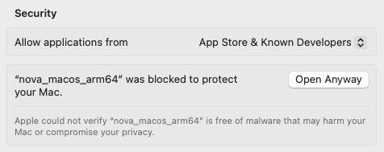

# Nova CLI

The swiss army knife for interacting with [Wandelbots NOVA](https://www.wandelbots.com/).

## Install

### MacOS/Linux

Installation with [homebrew](https://brew.sh/):
```bash
brew install wandelbotsgmbh/wandelbots/nova

# enable autocompletion for zsh (has to be done only once)
echo 'source <(nova completion zsh)' >> ~/.zshrc
```

**Note** Our binaries are not signed yet, thus MacOS will block the first execution.
To fix this, go to `Settings` -> `Privacy & Security` and click `Open Anyway`



### Windows

**Note** The certificate is currently self-signed and might need to be added manually to your computer.
To do so, please download the [source.msix](https://wandelbotsgmbh.github.io/winget-pkgs/) and follow [these instructions](https://www.advancedinstaller.com/install-test-certificate-from-msix.html) to add the certificate.

```bat
winget source add --name wandelbots --arg https://wandelbotsgmbh.github.io/winget-pkgs

winget install NovaCLI
```

### Other Platforms

Find the latest binaries under https://github.com/wandelbotsgmbh/nova-cli/releases

Unpack the nova binary, add it to your PATH and you should be ready for lift-off 🚀

[Completions are available](docs/nova_completion.md) for the most common terminals.

## Usage

The following examples should give you a rough overview whats possible with the CLI.
To see all possibilities, check the [docs](docs/nova.md) or `nova -h`

### Login To [Nova Cloud Instances](https://portal.wandelbots.io/de)

```bash
$ nova login
$ nova config set host your_instance_id.instance.wandelbots.io
```

### Open Homescreen

```bash
$ nova homescreen
```

### Use App Templates

For a more complete guide on how to develop apps, you can follow our [documentation](https://docs.wandelbots.io/24.10/intro-development/).

```bash
# create web application using nextjs 
$ nova app create myapp

# creating python application using fastapi
$ nova app create -g python_app
```

### Use Catalog

We publish pre-built applications in our [catalog](https://github.com/wandelbotsgmbh/catalog), 
which you can optionally install.

```bash
# list available entries
$ nova catalog list
jupyter
rerun
zivid-intel

# show some information about the entry
$ nova catalog info jupyter
Jupyter is a free, open-source, ...

# install entry to your instance
$ nova catalog install jupyter
```

### Manage Your Cell

```bash
# saves the current default cell to file
$ nova cell save

# edit the cell yaml in your favorite editor
$ nova cell edit

# install a cell from file
$ nova cell install path/to/your/cell.yaml
```
