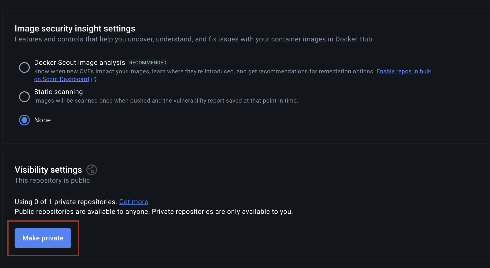

# Nova CLI

The Swiss Army knife for interacting with [Wandelbots NOVA](https://www.wandelbots.com/).

The CLI helps you build and deploy applications on the NOVA platform. You can also use it to download diagnostic logs and manage your applications. Your application is built as an OCI image, pushed to the specified registry, and then deployed on the specified instance.

## Table of Contents

- [Install](#install)
  - [MacOS/Linux](#macoslinux)
  - [Other Platforms](#other-platforms)
- [Setup](#setup)
  - [Setup OCI Registry](#setup-oci-registry)
  - [Configure Nova CLI](#configure-nova-cli)
  - [Login to Your Instance](#login-to-your-instance)
- [App Store](#app-store)
- [App Templates](#app-templates)
  - [Creating and Installing Apps](#creating-and-installing-apps)
  - [NovaX Applications](#novax-applications)
    - [Preconfigured Prompts](#preconfigured-prompts)
  - [TypeScript Application](#typescript-application)
- [Usage](#usage)
  - [Open Homescreen](#open-homescreen)
  - [Manage Your Cell](#manage-your-cell)

## Install

### MacOS/Linux

Installation with [homebrew](https://brew.sh/):
```bash
brew install wandelbotsgmbh/wandelbots/nova

# enable autocompletion for zsh (has to be done only once)
echo 'source <(nova completion zsh)' >> ~/.zshrc
```

**Note:** Our binaries are not signed yet, so macOS will block the first execution.
To fix this, go to `Settings` → `Privacy & Security` and click `Open Anyway`


### Other Platforms

Find the latest binaries at https://github.com/wandelbotsgmbh/nova-cli/releases

Download the binary, rename it to `nova`, and make it executable. Make sure to grant the file execute permissions, as the program is not signed. Add it to your PATH and you should be ready for lift-off 🚀

[Completions are available](docs/nova_completion.md) for the most common terminals.

## Setup

### Setup OCI Registry

To deploy applications, you need a container registry that NOVA can pull your apps from. We recommend the official public Docker registry for getting started quickly.

1. Create a Docker Hub account at https://hub.docker.com/signup
2. Install Docker Desktop from https://www.docker.com/products/docker-desktop/
3. Sign in to your account:
   ```bash
   docker login --username MY-DOCKER-USERNAME registry-1.docker.io
   ```
4. Configure the registry in the Nova CLI:
   ```bash
   nova config set image-registry registry-1.docker.io/MY-DOCKER-USERNAME
   ```

> [!WARNING]
> **Making Your Docker Registry Private**
> 
> If you are using Docker Hub and do not want to make your image available to the public, you can switch your Docker Hub repository to private:
> 
> 1. Go to your repository settings on Docker Hub
> 2. Switch the repository to "Make private"
> 
> 

### Configure Nova CLI

Configure your Nova CLI host. For physical instances, use the IP address (e.g., `192.168.1.100`). For virtual/cloud instances, use the URL (e.g., `my.instance.wandelbots.io`). If you don't specify the host, the CLI will use `local` as the default.

```bash
# For cloud instances
nova config set host your_instance_id.instance.wandelbots.io

# For physical instances  
nova config set host 192.168.1.100
```

### Login to Your Instance

Once you have configured your CLI, authenticate with your Nova instance:

```bash
# Login to production environment (default)
nova login

# Login to a specific environment (e.g., dev)
nova login -e dev
```

## App Store

We have a catalog of applications ready for you to install! We publish pre-built applications in our [catalog](https://github.com/wandelbotsgmbh/catalog), which you can install directly to your Nova instance.

```bash
# list available entries
$ nova catalog list
jupyter
rerun
zivid-intel

# show information about an entry
$ nova catalog info jupyter
Jupyter is a free, open-source, ...

# install an entry to your instance
$ nova catalog install jupyter
```

## App Templates

Nova CLI provides several application templates to help you get started quickly with different types of applications.

### Creating and Installing Apps

**Creating Applications:**

To create a new application, run:
```bash
nova app create my-app
```

> **💡 Tip:** If you're already logged in when you create an app, the `.env` file will automatically contain your authentication token and NOVA_API configuration, so you can start working with it immediately!

**Available App Templates:**

Nova CLI supports different application generators using the `-g` flag:

- `novax_app` - NovaX application template (default)
- `nextjs_app` - Next.js with TypeScript support

**Example Usage:**

```bash
# Create a TypeScript/Next.js app
nova app create 'my-typescript-app' -g "nextjs_app"

# Create a NovaX app (default)
nova app create 'my-novax-app' -g "novax_app"

# or simply (uses novax_app as default)
nova app create 'my-novax-app'
```

**Valid App Names:**
Your app name must follow these rules:
- Must start with a letter (a-z or A-Z)
- Can contain letters, numbers, and hyphens (-)
- Cannot be empty
- Examples: `my-app`, `RobotController`, `sensor-data-processor`

**Installing Your Application:**

Once created and logged in, install your application with:
```bash
nova app install my-app
```

### NovaX Applications

NovaX Applications are Python projects built with uv and FastAPI. It comes with default FastAPI routes but gives you full control over the FastAPI application. This is the fastest way to create custom applications with your robotics programs, powered by our Python SDK.

The NovaX application comes with default GitHub Copilot prompts so you can develop a robotics application and deploy it to your Nova instance with the help of Copilot, without writing a single line of code. We hope this will lower the barrier to using our tools for people without a software background and motivate them to take advantage of Nova and Copilot.

#### Preconfigured Prompts

The NovaX application template includes several GitHub Copilot prompts to guide you through the development process:

1. **local_setup** - Helps you do the local setup, making sure everything is installed and if not, guiding through the installation steps
2. **new_program** - Helps you write a new robotics program following best practices described in the Python SDK
3. **start_server** - Starts the local development server
4. **test_program** - Runs a given robotics program
5. **deploy_app** - Guides you through deploying your application to Nova
6. **copilot-instructions.md** - Describes the project structure and gives general guidelines about how to work in this project

> **⚠️ Warning:** While working with Copilot is great and speeds up development, it can sometimes create new problems. You might struggle to communicate your needs clearly to Copilot, or it might create overly complex solutions for simple problems. We strongly recommend learning Python basics - it will help you work with AI tools much more effectively and catch issues early.

Once you create a NovaX application, you can find these prompts in the `.github` folder of your project. They are written in plain English and will help you understand how to work in this repository.

Learn more about NovaX Applications: https://github.com/wandelbotsgmbh/wandelbots-nova?tab=readme-ov-file#novax

### TypeScript Application

The TypeScript Application is a Next.js application that comes with ready-to-use React components specifically designed for robotics applications. This template provides a solid foundation for building modern web interfaces for your Nova applications.

The Next.js template (`nextjs_app`) includes TypeScript configuration (`tsconfig.json`) and provides a full TypeScript development environment with Next.js framework support.

Learn more about the React components: https://github.com/wandelbotsgmbh/wandelbots-js-react-components

## Usage

The following examples give you a rough overview of what's possible with the CLI.
To see all possibilities, check the [docs](docs/nova.md) or run `nova -h`

### Open Homescreen

```bash
$ nova homescreen
```

### Manage Your Cell

```bash
# save the current default cell to a file
$ nova cell save

# edit the cell YAML in your favorite editor
$ nova cell edit

# install a cell from a file
$ nova cell install path/to/your/cell.yaml
```
